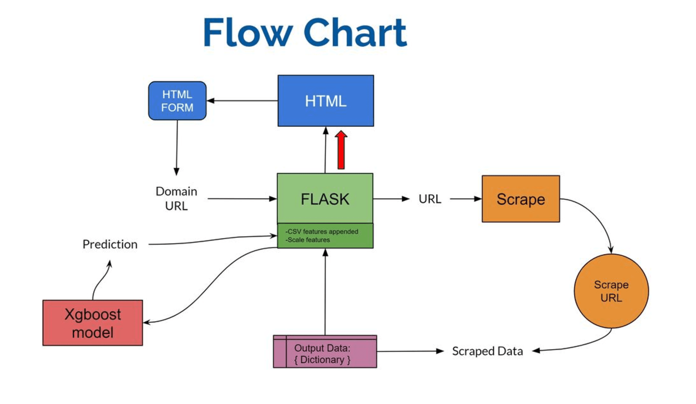
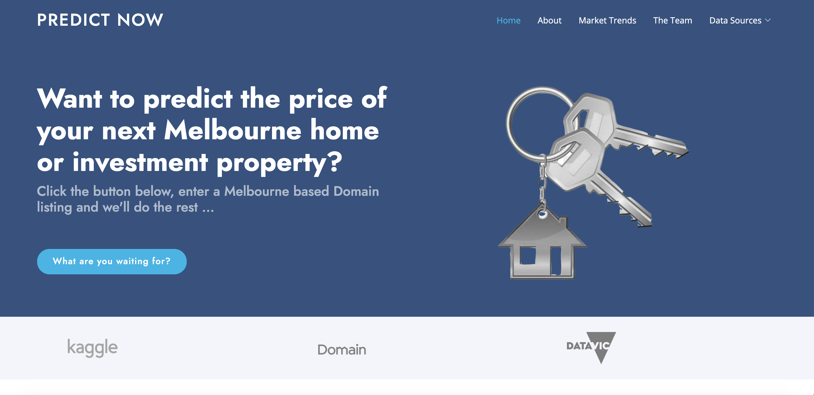
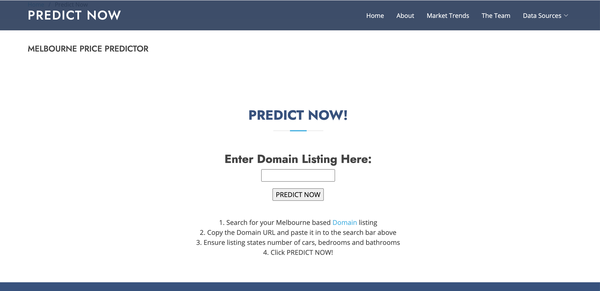
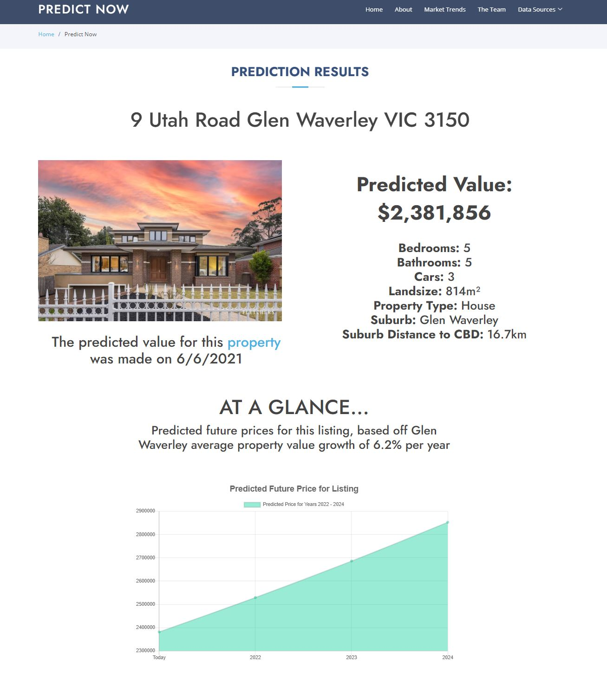
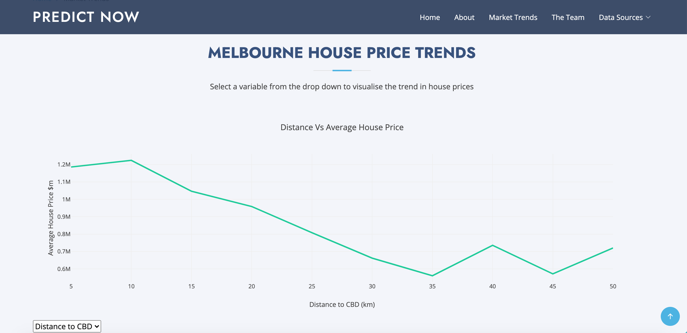

# Melbourne Property Price Predictor 

This project utilises Machine Learning to predict Melbourne property prices. It provides a simple resource for prospective property buyers to value listings they have found on Domain.com.au.  The web app scrapes property information from a provided Domain URL, appending crime and location information to the scraped data. The model then predicts a value for the property based on the listing information it receives. The web app also provides housing trend visualisations to assist potential property buyers in their research.

# Deployment

The project has been deployed to Heroku and is available here:
- [https://price-predictor-melb.herokuapp.com/](**https://melbpricepredictor.herokuapp.com/**).

# The Team 

- Tom Peddlesden: https://github.com/tomjp90 
- Catherine Sloan: https://github.com/catherinesloan
- Danielle Cahill: https://github.com/dan1ellec
- Anne Wieggers: https://github.com/annewieggers

# Data Sources 

- [Melbourne Housing Data](https://www.kaggle.com/anthonypino/melbourne-housing-market?select=Melbourne_housing_FULL.csv)

- [Victorian Crime Data](https://discover.data.vic.gov.au/dataset/crime-by-location-data-table)

# Libraries and Technologies 

**Machine Learning:**
- XGBoost
- Scikit-learn
- Pandas
- Joblib

**Back-End:**
- Python
- Flask
- Flask PyMongo
- Web Scraping
  - Requests
  - Selenium
  - BeautifulSoup 
  - Splinter
- Numpy	
- OS
- Datetime
- Heroku

**Front-End:**
- HTML
- CSS
- Javascript
  - D3
  - Plot.ly 
- Bootstrap
- Heroku

# Machine Learning 

The XGBRegressor model from the XGBoost library was utilised for this project. Two versions of the model were created to accomodate the variation in property information included on Domain. All property features were binary encoded and scaled for train and test our models.

**Model 1** was trained on the following features:
1. Number of Bedrooms
2. Number of Bathrooms
3. Number of Car Spaces
4. Property Type (Unit, Townhouse, House)
5. Year of sale
6. Month of sale
7. Suburb Crime Rate
8. Distance from CBD
9. Land Size

**Model 2** was trained on the following features:
1. Number of Bedrooms
2. Number of Bathrooms
3. Number of Car Spaces
4. Property Type (Unit, Townhouse, House)
5. Year of sale
6. Month of sale
7. Suburb Crime Rate
8. Distance from CBD

# Back End
The flow diagram shown belows illustrates how the lightweight web framework using Flask and written in Python works. 

# File Structure

- **data** folder: Contains CSVs used for the model input and graphing.
- **model** folder: Contains data inputs, cleaning files, data outputs, model training files, the models and a python file that runs the models.
- **static** folder: Contains javascript files, css files, bootstrap templates and images used for the webpage.
- **templates** folder: Contains all HTML files.
- **app.py** file: Backend flask file which references all HTML routes.
- **match_csvs.py** file: A python file that matches scraped data with additional csv data.
- **requirements.txt**: The requirements needed for the project to work. If running the project locally these requirements will need to be met.
- **scrape.py**: A python file that scrapes input data from Domain.com.

## Preview

